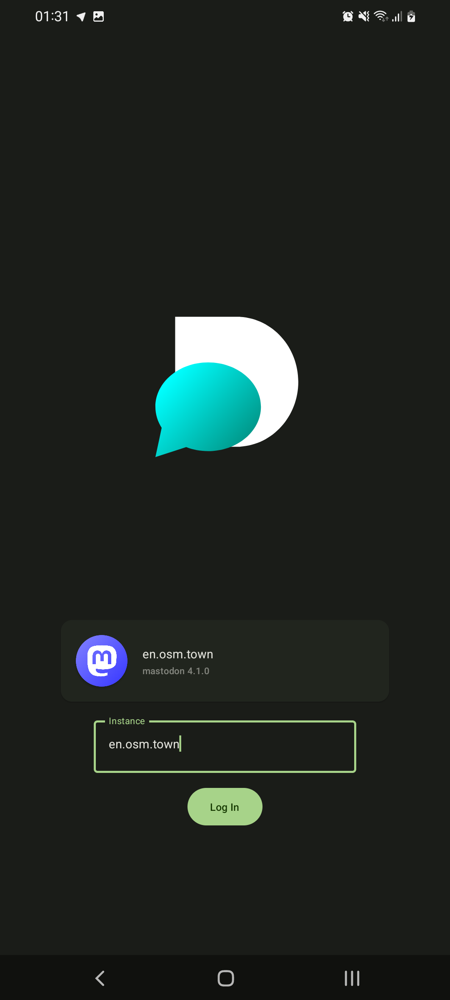
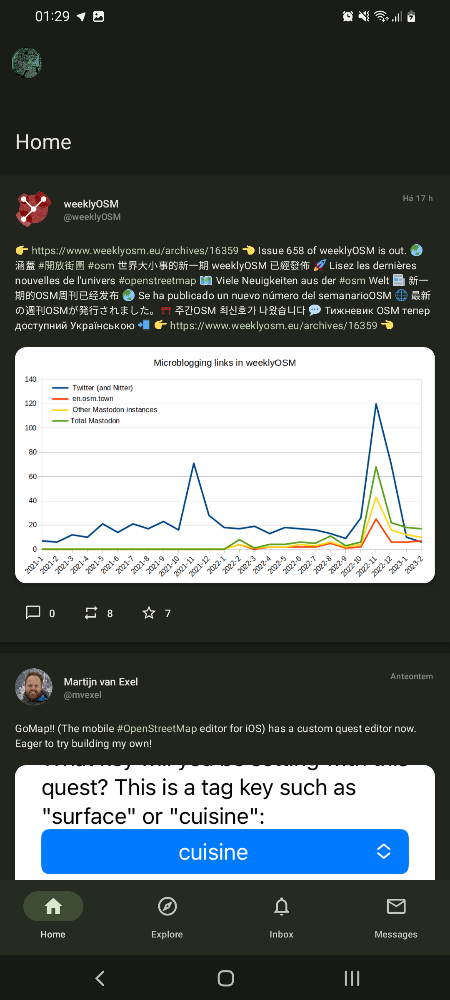

  

  
  # Dimett

  
  Material You Mastodon/Akkoma/Pleroma client
  
  ---
  
  
  
  
   
  
  
  
  

## Screenshots

| Instance Setup | Home |
| --------------- | --------------- |
|  | 

Installation
---
 1. Download the [latest actions build](https://nightly.link/MateriiApps/Dimett/workflows/android/main/Dimett.zip), if on PC then transfer the file over to your phone
 2. Unzip `Dimett.zip`
 3. Make sure to allow install unknown apps
 4. Install the apk

Build
---

#### Prerequisites
  - [Git](https://git-scm.com/downloads)
  - [JDK 17](https://www.oracle.com/java/technologies/javase/jdk17-archive-downloads.html)
  - [Android SDK](https://developer.android.com/studio)

#### Instructions

1. Clone the repo
    - `git clone https://github.com/MateriiApps/Dimett.git && cd Dimett`
2. Build the project
    - Linux: `chmod +x ./gradlew && gradlew assembleDebug`
    - Windows: `./gradlew assembleDebug`
3. Install on device
    - [Enable usb debugging](https://developer.android.com/studio/debug/dev-options) and plug in your phone
    - Run `adb install app/build/outputs/apk/debug/app-debug.apk`

## Contributing

This is an open-source project, you can do so without any programming.

Here are a few things you can do:

- [Test and report issues](https://github.com/MateriiApps/Dimett/issues/new/choose)
- [Translate the app into your language](https://crowdin.com/project/Dimett) Soon™
    
License
---
Dimett is licensed under the GNU General Public License v3.0

